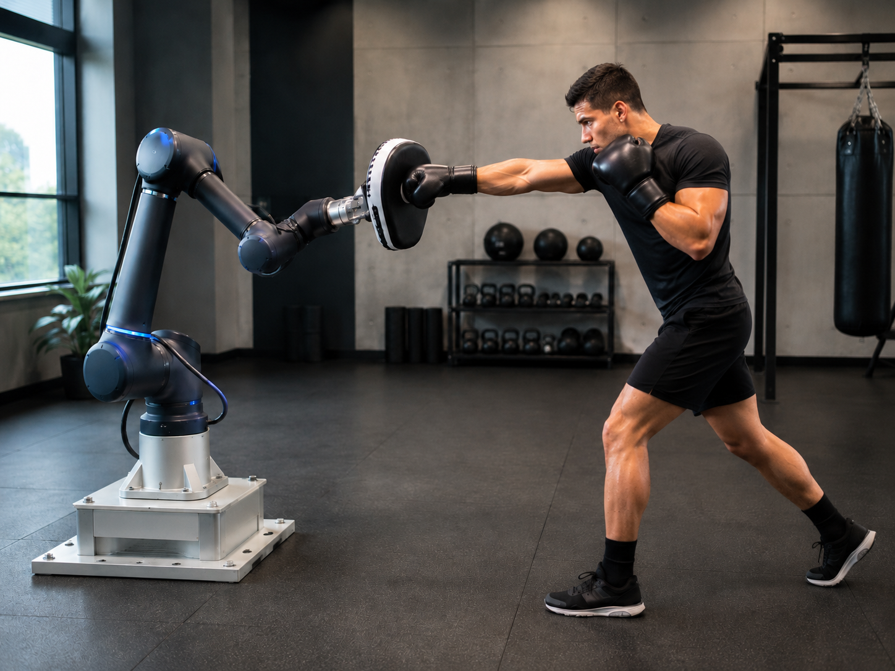
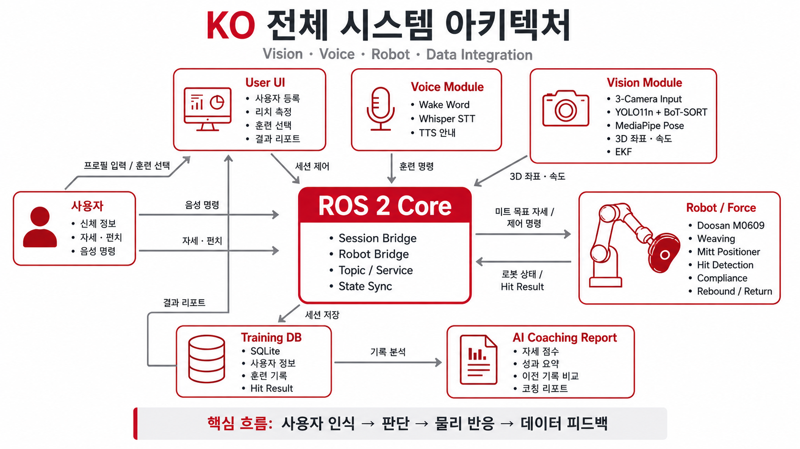

<div align="center">

# K.O — Intelligent Robotic Boxing Training System

### AI Vision · ROS 2 · Doosan M0609 기반 지능형 복싱 트레이닝 시스템

> 사용자 인식 → 개인별 미트 보정 → 로봇 반응 → 타격 분석 → 코칭 리포트

<br>



<br><br>


</div>

---

## 목차

1. [프로젝트 개요](#프로젝트-개요)
2. [최종 시스템 구조](#최종-시스템-구조)
3. [최종 실행 흐름](#최종-실행-흐름)
4. [사용자 맞춤 보정](#사용자-맞춤-보정)
5. [Vision](#vision)
6. [Robot / Force](#robot--force)
7. [UI · Voice · Coaching](#ui--voice--coaching)
8. [ROS 2 통합 구조](#ros-2-통합-구조)
9. [개발 환경](#개발-환경)
10. [설치](#설치)
11. [실행](#실행)
12. [검증](#검증)
13. [프로젝트 구조](#프로젝트-구조)
14. [안전 및 물리 검증 범위](#안전-및-물리-검증-범위)

---

## 프로젝트 개요

**K.O**는 사용자의 신체 정보와 펀치 동작을 인식하고, Doosan M0609 협동로봇이 실제 미트처럼 반응하며, 훈련 결과를 저장·분석하는 지능형 복싱 트레이닝 시스템입니다.

기존 샌드백처럼 고정된 위치만 반복 타격하는 방식에서 벗어나, 사용자별 도달 거리와 실제 타격 중심을 먼저 보정한 뒤 개인에게 맞는 미트 위치를 생성합니다. 훈련 중에는 Vision, Robot, Force, UI가 ROS 2를 통해 하나의 세션으로 동작하며, 타격 결과는 SQLite에 저장되고 코칭 리포트로 연결됩니다.

현재 최종 통합본의 **Production 물리 검증 우선 범위는 JAB / STRAIGHT**입니다. Hook / Uppercut 관련 코드와 파라미터는 보존되어 있지만, 이번 최종 통합에서 새로 구현·검증된 범위로 표현하지 않습니다.

### 핵심 기능

- RealSense + C270 × 2 기반 **3-Camera Vision**
- YOLO11n + BoT-SORT 기반 **복서 ID 고정**
- MediaPipe Pose 기반 **Guard / 손목·팔꿈치 추적**
- Triangulation + RealSense Depth + EKF 기반 **Robot BASE 3D 위치·속도**
- Guard 조건 충족 후 **READY 상태 전환**
- 사용자별 **1차 Reach Contact Calibration**
- Force HitResult 기반 **2차 5회 Mitt Center Calibration**
- 개인 보정값 저장 후 **TRAINING_READY**
- M0609 **BASE XZ Weaving**
- Force 기반 **Hit Detection / Compliance / Rebound / Return**
- Wake Word + OpenAI Whisper STT 기반 **비접촉 훈련 제어**
- BEST / CHECK / 이전 기록 비교 및 **AI Coaching Report**

---

## 최종 시스템 구조

<p align="center">
  
</p>

| 구성 | 역할 |
|---|---|
| **User UI** | 사용자 등록, 신체 정보, 리치 측정, 훈련 선택, 결과 표시 |
| **Voice** | `Wake Up KO`, Whisper STT, TTS 안내 |
| **Vision** | 3-Camera 입력, Person ID, Pose, 3D 좌표·속도, Guard 상태 |
| **ROS 2 Core** | SessionBridge, Robot Bridge, Topic / Service, 상태 동기화 |
| **Robot / Force** | M0609 Weaving, Mitt Positioner, RT Force, Hit / Rebound / Return |
| **Training DB** | 사용자 정보, 리치·미트 보정값, 세션, HitResult 저장 |
| **Coaching** | BEST / CHECK, 이전 세션 비교, 이미지 기반 코칭 리포트 |

최종 구조의 중심은 `SessionBridge`입니다.  
`/mitt/start_test`와 `/mitt/stop_test`의 소유자를 하나로 제한하고, 로봇 준비 상태, 두 단계의 사용자 보정, HitResult 저장과 다음 타점 진행을 하나의 상태 흐름으로 관리합니다.

---

## 최종 실행 흐름

<p align="center">
  <a href="docs/images/ko_execution_sequence.png">
    
  </a>
</p>

K.O는 사용자 준비부터 개인별 보정, 실제 훈련, HitResult 저장과 코칭 리포트 생성까지를 하나의 세션 흐름으로 관리합니다.

특히 최종 시스템에서는 Guard `READY`만으로 훈련을 시작하지 않고, **1차 Reach Contact Calibration과 2차 5-Hit Force Centering을 모두 완료한 뒤 `TRAINING_READY` 상태가 확인되어야 실제 Countdown이 시작됩니다.**

### 실행 흐름에서 중요한 상태

- 카메라 정렬이 끝나기 전까지 Weaving 유지
- `training_start` 이후 Weaving 정지
- Robot Action Ready 이후 Punching Ready 이동
- 1차 Reach Calibration 완료
- 2차 5-Hit Calibration 완료
- 모든 보정이 끝난 경우에만 `TRAINING_READY`
- UI Countdown은 `TRAINING_READY` 이후 시작
- 훈련 종료 후 Force Session 종료 → Weaving Ready 복귀 → Weaving 재시작

<p align="center">
  <a href="docs/images/KO_flowchart.jpg">
    
  </a>
</p>

> UI · Calibration · 실시간 Vision · Robot/Force 연동의 세부 흐름은 위 최종 통합 플로우차트에서 확인할 수 있습니다.

---

## 사용자 맞춤 보정

최종 코드에서는 단순히 Vision으로 5개의 손 위치를 평균내는 방식이 아니라 **Force까지 포함한 2단계 사용자 보정**을 사용합니다.

### 1차 — Reach Contact Calibration

사용자는 **주손 반대쪽, 즉 Jab-side 팔**을 앞으로 끝까지 뻗고 정지합니다.

로봇 미트는 현재 미트 면의 법선 방향인 **Tool +Z**를 따라 천천히 접근하며, 실제 Force Contact가 감지되는 위치를 사용자의 도달 거리 기준으로 저장합니다.

```text
Jab-side 팔 정지
    ↓
Force Baseline
    ↓
Mitt Tool +Z 저속 접근
    ↓
접촉 감지
    ↓
실제 Reach Correction 저장
    ↓
사용자 팔 / 미트 접촉 해제
```

### 2차 — Five-Hit Force Centering

1차 보정 이후 실제 HitTest / Force / Compliance 세션을 활성화합니다.

사용자가 미트를 5회 타격하면 각 타격의 Force 기반 접촉 위치인 `hit_x_mm`, `hit_y_mm`을 이용해 미트 중심을 보정합니다. 의도적인 로봇 이동은 Motion Guard로 구분하고, 각 보정 이동이 끝날 때마다 새로운 Settled Pose를 다시 잡고 Wrench Zero를 재보정합니다.

```text
Wrench Zero
    ↓
Punch #1
    ↓
Force Hit X/Y
    ↓
Mitt Center Correction
    ↓
Settled Pose + Re-zero
    ↓
...
    ↓
Punch #5
    ↓
최종 사용자 Mitt Correction 저장
    ↓
TRAINING_READY
```

사용자별 보정 결과는 SQLite의 `user_reach_calibrations`, `user_mitt_calibrations`에 저장됩니다.

---

## Vision

### Hybrid Tracking

Vision은 **YOLO11n + BoT-SORT**와 **MediaPipe Pose**를 역할 분리하여 사용합니다.

- YOLO11n + BoT-SORT
  - 복서 탐지
  - Person ID 고정
  - ROI 선택
- MediaPipe Pose
  - 손목 / 팔꿈치 / 어깨 / 코 관절 추론
  - Guard 판정
  - 3D Triangulation 입력 생성
- RealSense Depth
  - BASE 영역 기반 타겟 필터
  - 3D 결과 비교·보조
- EKF
  - 3D 위치 + 속도 추정
  - Outlier 제거
  - Stale 좌표 차단

### Guard Ready

Guard 판정은 Front MediaPipe 결과를 기준으로 하며, **Vision 내부에서 사용자의 자세가 안정적으로 준비되었는지 확인하는 상태**입니다.

- 양 어깨 거리로 Body Scale 계산
- 양 손목과 코 사이 거리 정규화
- 손목 속도 확인
- 조건을 연속 프레임 동안 유지

현재 `config/runtime.yaml` 기준:

```text
guard_max_wrist_nose_ratio = 1.85
guard_max_speed_body_s     = 0.45
guard_ready_frames         = 4
```

양손이 Guard 범위 안에 있고 손 움직임이 충분히 안정된 상태가 4프레임 유지되면 Vision 상태가 `READY`로 전환됩니다.

> **주의:** `READY`는 Guard 판정 결과이며 실제 훈련 시작 신호와는 다릅니다.  
> 실제 UI Countdown과 본 훈련은 **Reach Contact Calibration + 5-Hit Force Centering이 모두 끝난 뒤 SessionBridge가 `TRAINING_READY`를 발행했을 때** 시작됩니다.

### 3D Fist State

3대 카메라 관측 중 최소 2대를 사용해 강건 삼각측량을 수행하고, 필요 시 RealSense Depth를 약하게 융합합니다.

주요 ROS 출력:

```text
/sandbag/fist_state
/sandbag/fist_position_base_mm/left
/sandbag/fist_position_base_mm/right
/sandbag/fist_velocity_base_mm_s/left
/sandbag/fist_velocity_base_mm_s/right
```

로봇 측에서는 단순 좌표만 사용하지 않고 `valid`, `measurement_age_ms`, `position_std_mm` 등의 상태를 함께 확인해야 합니다.

### Training 중 Vision 사용

최종 통합본은 보정이 끝난 뒤에도 Vision을 유지합니다.

훈련 중에도 `/sandbag/fist_state`가 **bounded punch-target predictor**에 입력되며, 예측 이동은 최대 허용 오프셋과 도달 시간 조건 안에서 제한됩니다. Force HitResult가 실제 접촉 판정의 기준으로 저장됩니다.

---

## Camera ↔ Robot Calibration

카메라 간 Pairwise 변환 체인을 만들지 않고, 각 카메라를 **Robot BASE에 직접 정렬**합니다.

```text
Front RealSense ──┐
Left C270 ────────┼──→ Robot BASE
Right C270 ───────┘
```

주요 도구:

```text
calibration_tools/
├── 00_check_cameras.py
├── 01_intrinsic_calibration.py
├── 02_collect_external_samples.py
├── 03_solve_external_calibration.py
├── 04_validate_robot_world.py
├── 05_robot_world_transform.py
└── 06_enable_manual_teaching.py
```

최종 결과는 `calibration/results/robot_world.yaml`을 기준으로 사용합니다. 카메라 위치·각도·장비가 변경되면 재검증이 필요합니다.

---

## Robot / Force

### M0609 기준 자세

최종 통합에서는 **HOME / Weaving Ready / Punching Ready를 서로 다른 기준 상태로 분리**합니다.  
특히 Weaving Ready와 실제 펀치 대응용 Punching Ready를 별도 Pose로 관리해, 대기 동작과 훈련 동작의 상태 소유권이 섞이지 않도록 구성했습니다.

### Weaving

Weaving은 BASE `XZ` 평면에서 수행됩니다.

- X: `-85 ~ +85 mm`
- Z: `0 ~ -68 mm`
- 상대 Y: `0`
- U형 반복 경로
- 카메라 정렬 / UI 준비 중 계속 수행
- `training_start`에서 Soft Stop 후 로봇 제어를 SessionBridge에 인계

### Force / Hit

RT Force Stack은 다음 기능을 포함합니다.

- RT wrench 읽기 및 frame correction
- Wrench Zero Calibration
- Hit Detection
- Hit Point Estimation
- Hit Score 계산
- Compliance
- Force-scaled Rebound
- Return-to-reference
- HitResult 기록

세부 Force Threshold와 Mitt 크기 등의 튜닝 값은 `force_control/boxing_robot_ws`의 파라미터 파일에서 관리합니다.

Force / Compliance 관련 application watchdog는 실제 Doosan Controller의 Safety 기능을 대체하지 않습니다.

---

## UI · Voice · Coaching

### USER / ADMIN

- USER
  - 사용자 등록
  - 리치 측정
  - 훈련 선택
  - 실시간 훈련
  - 결과 리포트
- ADMIN
  - LEFT / FRONT / RIGHT 카메라
  - Vision / Guard / Impact 상태
  - Robot BASE P / V
  - 시스템 진단 상태

ADMIN 실행:

```bash
./run_final.sh --admin-mode
```

### Voice

실운영 `run_final.sh`에서는 Wake Word를 기본 활성화합니다.

```text
Wake Up KO
    ↓
Whisper STT
    ↓
훈련 명령
    ↓
UI / ROS 2 command
```

Wakeword 환경은 `./setup.sh` 과정에서 `ui/setup_ui.sh`를 통해 준비됩니다.

### KO Coaching Report

훈련 결과는 먼저 로컬 측정값으로 BEST / CHECK를 결정합니다.

OpenAI 코칭을 사용하는 경우 대표 `impact_triptych.jpg` 중 **BEST PUNCH 1장 + CHECK POINT 1장**을 우선 사용하며, 이전 동일 훈련 결과와 함께 코칭 설명을 생성합니다.

코칭 Prompt에는 **England Boxing Level 1 Coaching Handbook**의 간결한 참고 가이드를 포함하지만, 실제 측정 데이터와 이미지 증거를 우선하며 확인할 수 없는 동작을 임의로 추정하지 않도록 제한합니다.

API 키 설정:

```bash
python3 ui/configure_api_key.py
```

키는 `ui/.env`에 저장되고 브라우저로 전달되지 않습니다. OpenAI 분석이 실패해도 훈련 결과 저장은 중단되지 않고 로컬 피드백으로 복귀합니다.

---

## ROS 2 통합 구조

Force workspace에는 다음 패키지가 포함되어 있습니다.

| Package | 역할 |
|---|---|
| `boxing_integration` | UI / Vision / Robot / Force를 연결하는 SessionBridge |
| `boxing_interfaces` | 서비스·메시지 인터페이스 |
| `mitt_hit_system` | Force, Hit, Compliance, Rebound, Mitt Positioner |
| `mitt_hit_bringup` | 통합 Launch 및 파라미터 |

### 최종 상태 소유권

- `SessionBridge`
  - Robot / Training State Owner
  - StartHitTest / StopHitTest 단일 소유자
  - 사용자 Reach / Mitt Calibration
  - HitResult routing
  - Next Target / Training Ready 관리

- `robot_weaving_node.py`
  - HOME / Weaving Ready
  - BASE XZ Weaving
  - Soft Stop
  - `/robot_boxing/action_ready`

- `ui_robot_bridge.py`
  - UI Command Queue ↔ ROS Command / Status

---

## 개발 환경

| 항목 | 내용 |
|---|---|
| OS | Ubuntu 22.04 |
| ROS 2 | Humble |
| Python | 3.10 |
| Robot | Doosan M0609 |
| Front Camera | Intel RealSense D435 / D435i |
| Side Cameras | Logitech C270 × 2 |
| Vision | YOLO11n, BoT-SORT, MediaPipe, OpenCV |
| 3D / Filter | Triangulation, RealSense Depth, EKF |
| Voice | openWakeWord, OpenAI Whisper STT, Browser Speech Synthesis |
| UI | Flask, HTML, CSS, JavaScript |
| DB | SQLite |
| AI Coaching | OpenAI Responses API (선택) |

`setup.sh`는 NVIDIA GPU 존재 여부를 확인해 PyTorch CPU / CUDA 환경을 자동 선택합니다.

---

## 설치

### 필수 시스템

- Ubuntu 22.04
- Python 3.10
- ROS 2 Humble
- `colcon`
- RealSense SDK / udev
- C270 V4L2 접근 권한
- Doosan `roboton`, `dsr_msgs2`, `DR_init`, `DSR_ROBOT2`
- GPU 사용 시 NVIDIA Driver

기본 Ubuntu 패키지:

```bash
sudo apt update
sudo apt install -y \
  python3 python3-venv python3-pip unzip v4l-utils \
  libgl1 libglib2.0-0 portaudio19-dev
```

### 프로젝트 환경 구성

```bash
chmod +x ./*.sh ui/*.sh robot_control/*.sh
./setup.sh --build-force
```

CPU 강제:

```bash
./setup.sh --cpu --build-force
```

CUDA 강제:

```bash
./setup.sh --cuda --build-force
```

---

## 실행

### 1. 카메라 / 설정 확인

```bash
source /opt/ros/humble/setup.bash
./.venv/bin/python tools/check_config.py
./.venv/bin/python tools/assign_cameras.py
```

### 2. 실제 최종 통합 실행

먼저 Doosan `roboton`과 필수 서비스가 정상 실행 중인지 확인합니다.

USER Mode:

```bash
./run_final.sh
```

ADMIN Mode:

```bash
./run_final.sh --admin-mode
```

`run_final.sh`는 다음을 수행합니다.

1. Wake Word 기본 활성화
2. 중복 실행 Lock 검사
3. Force workspace 경로 / build stamp 확인
4. Force source 변경 시 자동 재빌드
5. Hardware Preflight
6. USER UI + Vision + Robot Weaving + Force / SessionBridge 통합 시작

### 3. 개발용 부분 실행

```bash
# Vision
./run_vision.sh

# UI + Vision 중심 통합
./run_integrated.sh

# Force stack
./force_control/run_force_stack.sh
```

종료:

```bash
./stop_all.sh
```

---

## 검증

### 최종 자동 검증 결과

`FINAL_TEST_REPORT.md` 기준:

| 검증 | 결과 |
|---|---:|
| Final Integration Contract | **PASS** |
| UI/API + Force/Rebound/Mitt | **154 PASS + 18 subtests PASS** |
| Vision ROS-independent Regression | **21 PASS** |
| Python Compile | **PASS** |
| YAML Parse | **15 files / 0 errors** |
| ROS `package.xml` Parse | **4 files / 0 errors** |
| JavaScript Syntax | **PASS** |

Target PC에서:

```bash
./test_final.sh
./test_final.sh --hardware
```

Hardware Preflight는 실제 프로젝트 Robot Motion을 실행하지 않고 다음 항목을 확인합니다.

- C270 LEFT / RIGHT
- RealSense RGB / Depth
- 마이크 / Wake Word
- ROS 2 Humble
- Doosan 필수 Service
- Force workspace overlay
- 소프트웨어 회귀검사

---

## 프로젝트 구조

```text
KO/
├── calibration/                  # 최종 Robot-world / Intrinsic 결과
├── calibration_tools/            # Camera ↔ Robot BASE Calibration
├── config/                       # Vision / Camera / Mitt 설정
├── force_control/
│   └── boxing_robot_ws/
│       └── src/
│           ├── boxing_integration/
│           ├── boxing_interfaces/
│           ├── mitt_hit_bringup/
│           └── mitt_hit_system/
├── interfaces/                   # 프로젝트 인터페이스 정의
├── models/                       # YOLO / MediaPipe 모델
├── msg/                          # FistState schema
├── robot_control/                # M0609 Weaving / UI-Robot Bridge
├── sandbag_vision/               # 3-Camera Vision Runtime
├── tests/                        # Vision 회귀 테스트
├── tools/                        # Preflight / 설정 / 배포 도구
├── ui/                           # Flask UI / Voice / Report / DB
├── setup.sh
├── preflight.sh
├── run_final.sh                  # 최종 실행
├── run_integrated.sh
├── test_final.sh                 # 최종 검증
├── stop_all.sh
├── FINAL_INTEGRATION.md
├── FINAL_TEST_REPORT.md
└── DEPLOYMENT.md
```

배포 파일 생성:

```bash
./tools/create_deploy_bundle.sh
```

실행 결과, 사용자 DB, API Key, Python 가상환경 및 빌드 산출물은 배포본에서 제외됩니다.

---

## 안전 및 물리 검증 범위

자동 테스트와 Hardware Preflight는 **실제 로봇의 물리 안전성을 인증하지 않습니다.**

최초 실제 장비 검증은 반드시 낮은 속도에서 다음 순서로 진행합니다.

```text
BASE XZ Weaving
    ↓
Camera Alignment Handoff
    ↓
Punching Ready
    ↓
Reach Contact Calibration
    ↓
5-Hit / Wrench Zero Calibration
    ↓
JAB / STRAIGHT
    ↓
Training Stop
    ↓
Weaving Ready Return
```

특히 아래 항목은 Target Rig에서 직접 확인해야 합니다.

- 실제 Mitt Face Tool +Z 접근 방향
- Reach Contact Threshold / Release
- 5-Hit 보정 방향과 보정량
- 각 보정 이동 후 Wrench Zero 타이밍
- Compliance / Rebound 체감
- Vision Target Follow 범위
- Collision Clearance
- 정상 Stop → Weaving 복귀

> **현재 Production 검증 우선 범위: JAB / STRAIGHT**  
> Hook / Uppercut은 코드와 파라미터를 유지하지만, 잽·스트레이트 물리 검증 완료 후 확장하는 것을 기준으로 합니다.

---

## 참고 문서

- [`FINAL_INTEGRATION.md`](FINAL_INTEGRATION.md) — 최종 통합 소유권·런타임 흐름
- [`FINAL_TEST_REPORT.md`](FINAL_TEST_REPORT.md) — 최종 자동 검증 결과
- [`DEPLOYMENT.md`](DEPLOYMENT.md) — 배포 및 설치
- [`ui/README.md`](ui/README.md) — UI / OpenAI Coaching / Vision Bridge
- [`calibration_tools/README.md`](calibration_tools/README.md) — Camera ↔ Robot Calibration
- [`force_control/boxing_robot_ws/README_BOXING_BACKEND.md`](force_control/boxing_robot_ws/README_BOXING_BACKEND.md) — Force / Mitt Backend

---

## Project Summary

> **K.O는 3-Camera Vision으로 사용자를 인식하고, Force 기반 2단계 개인 미트 보정을 거쳐 Doosan M0609이 사용자에 맞게 반응하며, HitResult와 코칭 데이터를 하나의 ROS 2 세션으로 연결하는 지능형 로봇 복싱 트레이닝 시스템입니다.**
